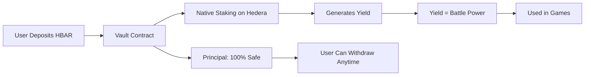
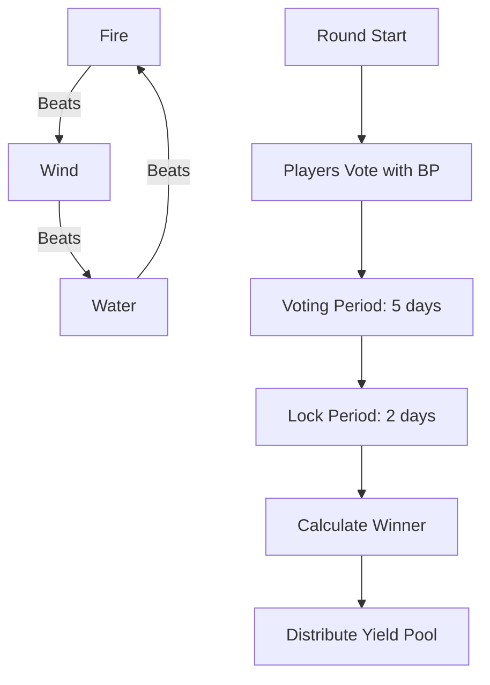
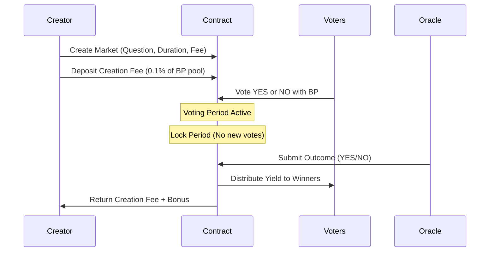

# OneSafeBet: A Fair No-Loss Gaming Platform

## The Problem

The online gambling industry suffers from fundamental issues that harm millions of users:

- Over 26% of online gamblers report significant financial losses (source: National Council on Problem Gambling)
- 80% of gamblers eventually lose money due to house edge and unfair odds
- Traditional gambling platforms provide zero capital protection
- Users risk their entire principal on every bet with no recourse

I witnessed friends and family members lose substantial amounts to online gambling platforms where the odds are inherently stacked against them. This motivated me to create a fundamentally different approach.

## My Solution

OneSafeBet is a gamified no-loss prediction platform built on Hedera that completely eliminates principal risk. I leverage DeFi staking mechanisms to generate yield, which becomes the reward pool. Users never lose their deposited capital - only the yield generated is at stake.

**Core Principle**: Your money stays yours. Only the interest fights.

## How It Works

### The Vault System



1. Users deposit HBAR into my Vault smart contract
2. The Vault stakes HBAR natively on Hedera network
3. Staking rewards accumulate as yield
4. This yield is converted to "Battle Power" (BP) for gameplay
5. Principal remains locked but 100% withdrawable at any time

### Game 1: Elemental Triad

A strategic faction-based game using rock-paper-scissors mechanics with three elements:

**Mechanic Overview**:



**Game Flow**:
- Each round lasts 7 days (5 days voting + 2 days locked)
- Players commit their Battle Power to one of three factions: Fire, Water, or Wind
- Fire beats Wind, Wind beats Water, Water beats Fire
- Winner is determined by Net Advantage Score: (Target Faction % - Predator Faction %)
- Winners share the entire yield pool proportionally to their BP contribution

**Example**:
If 40% vote Fire, 35% vote Water, 25% vote Wind:
- Fire Score = 25% (Wind) - 35% (Water) = -10%
- Water Score = 40% (Fire) - 25% (Wind) = +15%
- Wind Score = 35% (Water) - 40% (Fire) = -5%
- Water wins and all Water voters split the yield pool

### Game 2: Prediction Market

A decentralized prediction market where users create and bet on real-world outcomes.

**Market Mechanics**:



**Market Flow**:
1. Anyone can create a prediction market by asking a YES/NO question
2. Creator pays a small fee (0.1% of total BP pool) to prevent spam
3. Users vote YES or NO by committing their Battle Power
4. After deadline, an oracle resolves the outcome
5. Winning side shares the yield pool proportionally
6. Market creator receives their fee back plus a creation bonus

**Example Market**:
"Will Bitcoin reach $100,000 by end of Q1 2025?"
- 60% vote YES with 600 HBAR BP
- 40% vote NO with 400 HBAR BP
- Total yield pool: 50 HBAR (from staking rewards)
- If outcome is YES: Each YES voter gets (their BP / 600) * 50 HBAR
- If outcome is NO: Each NO voter gets (their BP / 400) * 50 HBAR

## Technical Architecture

### Smart Contracts (Solidity 0.8.13)

- **Vault.sol**: Manages deposits, withdrawals, and native staking
- **ElementalGame.sol**: Implements the Triad game logic and reward distribution
- **PredictionMarket.sol**: Handles market creation, voting, and resolution
- **QuestManager.sol**: NFT badge system for achievements using Hedera Token Service

### Frontend (Next.js 16)

- React 19 with TypeScript
- Wagmi v2 for Hedera wallet integration
- Tailwind CSS v4 for responsive design
- Real-time game state updates

### Blockchain

- Hedera Hashgraph Testnet
- Native HBAR staking for yield generation
- Low transaction fees (0.0001 HBAR)
- Fast finality (3-5 seconds)

## Impact on the Ecosystem

### For Users
- Zero principal risk gaming experience
- Passive income from staking even while playing
- Transparent, verifiable smart contract rules
- Complete control over deposited funds

### For Hedera Ecosystem
- Drives HBAR staking participation and network security
- Showcases Hedera's smart contract capabilities
- Demonstrates novel DeFi use cases beyond traditional finance
- Increases transaction volume on the network

### For the Industry
- Proves gambling/gaming can be fair and transparent
- Sets new standard for user fund protection
- Combines DeFi yields with entertainment value
- Reduces gambling addiction risks by eliminating capital loss

## Development Roadmap

### Phase 1: Foundation (Current)
- Core smart contracts development
- Vault and staking mechanism implementation
- Basic Elemental Triad game functionality
- Frontend MVP with wallet connection
- Testnet deployment and testing

### Phase 2: Enhancement
- Prediction Market contract integration
- Quest and achievement NFT system
- Advanced analytics dashboard
- Mobile-responsive UI improvements
- Comprehensive smart contract audits

### Phase 3: Community Growth
- Mainnet deployment on Hedera
- Community governance token launch
- Decentralized oracle network for predictions
- Referral and reward programs
- Partnership with Hedera DeFi protocols

### Phase 4: Expansion
- Multi-asset staking support (USDC, SAUCE, etc.)
- Additional game modes and mechanics
- Cross-chain yield aggregation
- Native mobile applications (iOS/Android)
- API for third-party integrations

### Phase 5: Decentralization
- DAO governance implementation
- Community-driven game design
- Decentralized oracle operators
- Protocol fee distribution to token holders
- Full protocol ownership transfer to community

## Project Repository Structure

```
OneSafeBet/
├── Frontend/              # Next.js application
│   ├── app/              # Pages and routes
│   ├── components/       # React components
│   ├── contracts/        # Contract ABIs and types
│   └── hooks/            # Custom React hooks
│
├── smartContract/        # Foundry project
│   ├── src/             # Solidity contracts
│   ├── test/            # Contract tests
│   ├── script/          # Deployment scripts
│   └── broadcast/       # Deployment records
│
└── README.md            # This file
```

## Getting Started

### Prerequisites
- Node.js 18+ and pnpm
- Foundry for smart contract development
- Hedera testnet account and HBAR

### Smart Contract Setup

```bash
cd smartContract
forge install
forge build
forge test

# Deploy to Hedera testnet
forge script script/Deploy.s.sol --rpc-url $HEDERA_TESTNET_RPC --broadcast
```

### Frontend Setup

```bash
cd Frontend
pnpm install
pnpm dev

# Open http://localhost:3000
```

### Environment Variables

Create `.env` files with:

**smartContract/.env**:
```
PRIVATE_KEY=your_private_key
HEDERA_TESTNET_RPC=https://testnet.hashio.io/api
```

**Frontend/.env.local**:
```
NEXT_PUBLIC_VAULT_ADDRESS=0x...
NEXT_PUBLIC_ELEMENTAL_GAME_ADDRESS=0x...
NEXT_PUBLIC_PREDICTION_MARKET_ADDRESS=0x...
```

## Why This Matters

I built OneSafeBet because I believe gaming and predictions can be entertaining without being predatory. By removing principal risk and ensuring transparency through blockchain technology, I am creating a platform where:

- Users can have fun without fear of losing their savings
- Everyone can verify the fairness of every game outcome
- The house doesn't always win - the yield is redistributed fairly
- Blockchain technology serves a real social good

This is not just another DeFi protocol or gambling site. This is a demonstration that Web3 can solve real problems and create genuinely better experiences than Web2 alternatives.

## License

MIT

## Contact

For questions, suggestions, or collaboration opportunities, please open an issue on GitHub.
