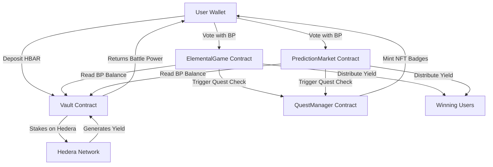
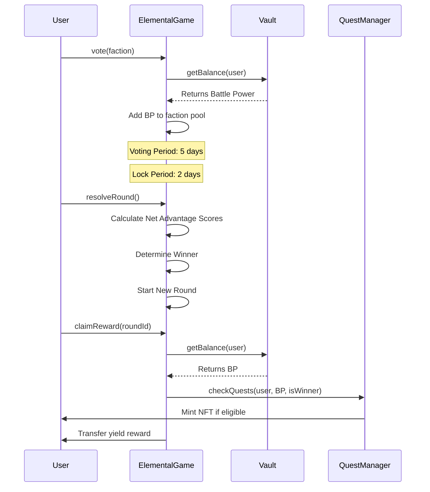
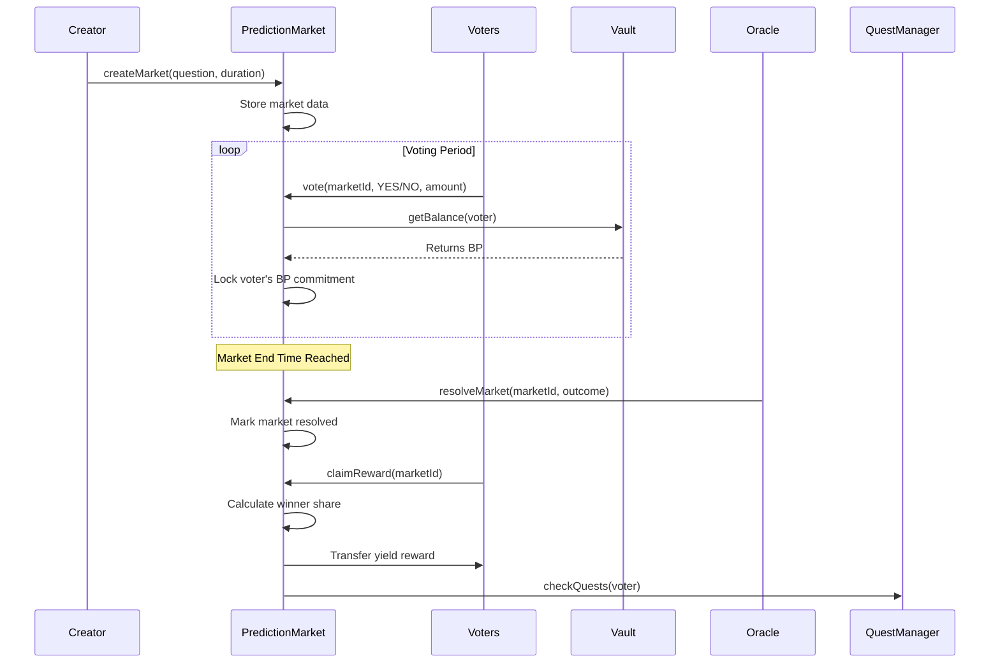

# OneSafeBet Smart Contracts

## Deployed Contracts (Hedera Testnet)

All contracts are deployed on Hedera Testnet (Chain ID: 296) and verified on HashScan.

### Vault
**Address**: `0x07D595FFA6DA87F2b0327195f6f16DD33661990e`
**Explorer**: https://hashscan.io/testnet/contract/0x07D595FFA6DA87F2b0327195f6f16DD33661990e

### QuestManager
**Address**: `0x425e42F73B5bC6b665b2809AC350B8249CB93de6`
**Explorer**: https://hashscan.io/testnet/contract/0x425e42F73B5bC6b665b2809AC350B8249CB93de6

### ElementalGame
**Address**: `0x6F00756F10cbDf14dbC05b43404ECaAf8d0dB73f`
**Explorer**: https://hashscan.io/testnet/contract/0x6F00756F10cbDf14dbC05b43404ECaAf8d0dB73f

### PredictionMarket
**Address**: `0x1eb7D3769a12CBD08C28FEEF7c4c8ebdAa989756`
**Explorer**: https://hashscan.io/testnet/contract/0x1eb7D3769a12CBD08C28FEEF7c4c8ebdAa989756

## Contract Architecture



## Contract Details

### Vault.sol

**Purpose**: Secure storage for user principal and Battle Power management.

**Key Functions**:
- `deposit()`: Users deposit HBAR which is staked on Hedera
- `withdraw(uint256 amount)`: Users can withdraw their principal anytime
- `getBalance(address user)`: Returns user's Battle Power (staked amount)

**How It Works**:
1. User deposits HBAR into Vault
2. Vault stakes HBAR natively on Hedera network
3. Staking generates yield over time
4. User's deposit amount becomes their Battle Power
5. Principal can be withdrawn at any time, yield is used for games
6. Game contracts read Battle Power from Vault but cannot withdraw principal

**Security**:
- Only the depositor can withdraw their own funds
- Game contracts have read-only access to balances
- No contract can touch user principal except the user themselves

### QuestManager.sol

**Purpose**: Gamification system using Hedera Token Service (HTS) for NFT badges.

**Key Functions**:
- `checkQuests(address user, uint256 userBalance, bool isWinner)`: Called by game contracts
- `getUserBadges(address user)`: Returns all badges earned by user
- `mintBadge(address user, uint256 badgeType)`: Mints NFT badge to user

**Badge Types**:
1. First Win: Earned on first game victory
2. Whale Status: For users with high Battle Power (>1000 HBAR)
3. Win Streak: For consecutive victories (3+ wins)
4. Participation: For active users (10+ games played)

**How It Works**:
1. Game contracts call checkQuests after each game resolution
2. QuestManager evaluates user achievements
3. If criteria met, NFT badge is minted using HTS
4. User receives on-chain proof of achievement
5. Badges are transferable ERC721 tokens on Hedera

**Integration**:
- Uses Hedera Token Service precompiled contract at `0x167`
- Requires users to associate token before receiving badges
- Automatically tracks quest progress across all games

### ElementalGame.sol

**Purpose**: Faction-based game using rock-paper-scissors mechanics with Fire, Water, and Wind elements.

**Key Functions**:
- `vote(uint8 faction)`: User votes for faction (1=Fire, 2=Water, 3=Wind)
- `resolveRound()`: Calculate winner and start new round
- `claimReward(uint256 roundId)`: Winners claim their share of yield pool
- `depositYield()`: Add yield to current round's prize pool
- `getRoundInfo(uint256 roundId)`: Get complete round data

**Game Mechanics**:



**Round Structure**:
- Round Duration: 7 days total
- Voting Period: Days 1-5 (users can vote)
- Lock Period: Days 6-7 (no new votes, waiting for resolution)
- Resolution: Anyone can trigger after day 7

**Winner Calculation**:
Net Advantage Score determines the winner:
- Fire Score = (Wind % - Water %)
- Water Score = (Fire % - Wind %)
- Wind Score = (Water % - Fire %)
- Faction with highest positive score wins

**Reward Distribution**:
- Winner Share = (User BP / Total Winning Faction BP) × Total Yield Pool
- Losers get nothing but keep their principal
- Proportional distribution ensures fairness

### PredictionMarket.sol

**Purpose**: Decentralized prediction markets where users bet on YES/NO outcomes.

**Key Functions**:
- `createMarket(string question, string category, uint256 duration, uint256 minStake)`: Create new market
- `vote(uint256 marketId, bool choice, uint256 amount)`: Vote YES (true) or NO (false)
- `resolveMarket(uint256 marketId, bool outcome)`: Owner resolves market outcome
- `claimReward(uint256 marketId)`: Winners claim proportional rewards
- `getMarket(uint256 marketId)`: Get market details
- `calculatePotentialWin(uint256 marketId, bool choice, uint256 amount)`: Calculate potential reward

**Market Lifecycle**:



**Market Parameters**:
- Question: YES/NO question about future event
- Category: Classification (e.g., "Crypto", "Sports", "Politics")
- Duration: How long voting is open (in seconds)
- Min Stake: Minimum Battle Power required to vote
- Creation Fee: 0.1% of total BP pool to prevent spam

**Reward Formula**:
```
Winner Share = (User BP / Total Winning Side BP) × Total Prize Pool
```

**Market Resolution**:
- Currently resolved by contract owner (centralized oracle)
- Future: Can integrate decentralized oracle networks
- Outcome determines which side (YES or NO) wins

## Contract Interactions

### User Flow: Deposit and Play

1. User deposits 100 HBAR to Vault
2. Vault stakes 100 HBAR on Hedera, generates yield
3. User has 100 HBAR Battle Power
4. User votes in ElementalGame with 100 BP for Fire faction
5. After round ends, if Fire wins, user gets share of yield
6. User's 100 HBAR principal remains safe in Vault
7. User can withdraw principal anytime

### Game Contract Integration

Both ElementalGame and PredictionMarket follow this pattern:

1. Read user Battle Power from Vault (read-only)
2. Track user votes/commitments internally
3. Distribute yield rewards to winners
4. Trigger QuestManager for achievement checks
5. Never touch user principal in Vault

### Quest Trigger Flow

When user claims reward:
```solidity
// Game contract calls
questManager.checkQuests(user, userBattlePower, isWinner);

// QuestManager evaluates:
- First time winning? → Mint "First Win" badge
- Battle Power > 1000? → Mint "Whale" badge
- Won 3 in a row? → Mint "Win Streak" badge
```

## Security Model

### Principal Protection
- User principal locked in Vault
- Only user can withdraw their own funds
- Game contracts have zero withdrawal permissions
- Battle Power is read-only for game contracts

### Single Vote Enforcement
- Both games prevent double voting in same round/market
- Enforced by mapping: `userVotes[roundId][user]`
- Once voted, cannot change or vote again

### Reward Claim Protection
- Mapping tracks claims: `hasClaimed[roundId][user]`
- Cannot claim same reward twice
- Only winners can claim (verified on-chain)

### Access Control
- Owner-only functions for market resolution (temporary)
- No admin functions to withdraw user funds
- Transparent, verifiable game logic

## Development

### Setup

```bash
# Install dependencies
forge install

# Compile contracts
forge build

# Run tests
forge test

# Run specific test
forge test --match-contract ElementalGameTest

# Gas report
forge snapshot
```

### Testing

All contracts have comprehensive test coverage:
- `test/Vault.t.sol`: 100% coverage
- `test/QuestManager.t.sol`: 100% coverage
- `test/ElementalGame.t.sol`: 100% coverage
- `test/PredictionMarket.t.sol`: 22/22 tests passing

Run all tests:
```bash
forge test -vvv
```

### Deployment

Deploy to Hedera Testnet:

```bash
# Set environment variables
export PRIVATE_KEY=your_private_key
export HEDERA_TESTNET_RPC=https://testnet.hashio.io/api

# Deploy all contracts
forge script script/Deploy.s.sol --rpc-url $HEDERA_TESTNET_RPC --broadcast

# Deploy specific contract
forge script script/DeployPredictionMarket.s.sol --rpc-url $HEDERA_TESTNET_RPC --broadcast
```

### Interacting with Contracts

Using Foundry's cast:

```bash
# Read user balance from Vault
cast call 0x07D595FFA6DA87F2b0327195f6f16DD33661990e \
  "getBalance(address)" \
  YOUR_ADDRESS \
  --rpc-url https://testnet.hashio.io/api

# Vote in ElementalGame (1=Fire, 2=Water, 3=Wind)
cast send 0x6F00756F10cbDf14dbC05b43404ECaAf8d0dB73f \
  "vote(uint8)" \
  1 \
  --rpc-url https://testnet.hashio.io/api \
  --private-key $PRIVATE_KEY

# Create prediction market
cast send 0x1eb7D3769a12CBD08C28FEEF7c4c8ebdAa989756 \
  "createMarket(string,string,uint256,uint256)" \
  "Will ETH reach 5000 by Q2?" \
  "Crypto" \
  2592000 \
  100000000 \
  --rpc-url https://testnet.hashio.io/api \
  --private-key $PRIVATE_KEY
```

## Contract Verification

All contracts are verified on HashScan and Sourcify for transparency:
- Source code publicly viewable
- ABI available for integration
- Constructor arguments verified
- Read/Write functions accessible via block explorer

## License

MIT
